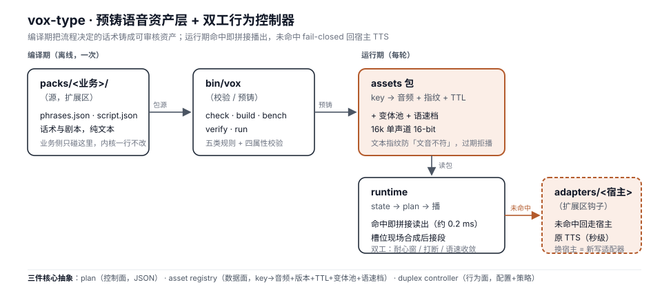

<div align="center">

# vox-type

**Pre-cast voice asset layer + duplex behaviour controller for voice agents**
**语音链路的预铸话术资产层 + 双工行为控制器**

[](LICENSE)
[](https://www.python.org)
[](https://github.com/starmcainiao/vox-type/actions/workflows/tests.yml)
[](#quick-start)

</div>

> 让语音链路里**流程决定的那部分话术**零延迟、零成本、可审核；不确定的部分才动用模型。
> 定位：**可短路语音栈的覆盖层**——级联链路（ASR→LLM→TTS）里坐在 LLM 与 TTS 之间，
> 端到端 S2S 模型里做整轮旁路。
>
> **第一次来？→ 先读 [`docs/22-五分钟跑起来`](docs/22-五分钟跑起来.md)**（clone 到听见声音，全真值输出）·
> 想看可跑的示例 → [`examples/`](examples/README.md) · 想加一个 TTS 引擎 → [`docs/23`](docs/23-如何新增一个TTS引擎.md)

**English one-liner**: vox-type pre-bakes the *process-determined* portion of a voice agent's
dialogue into audited, versioned audio assets, and plays them in ~0.2 ms when the upstream model
decides to speak them — falling back to your existing TTS path on every miss (fail-closed, fully
traced). Zero third-party dependencies.

---

## Why

1. **流程话术在替慢链路陪跑。** 一通「查一下账单」的电话，用户要等 ASR + LLM 首 token + TTS
   才能听到「请提供您的户号」——这句话由业务流程决定，却陪整条链路等了几秒，还烧一次推理。
   我们实测：预铸命中读包首响 **P50 0.232 ms**，链路级实时合成 **586.7 ms**（≈2530×，n 见 `docs/09`）。
2. **生成式话术不可审计。** 客服话术（催收/政务/通知）有合规要求，LLM 每次生成都在赌。
   预铸资产 = **字节级一致、可审核、可版本化**；源话术一改，指纹门禁自动让缓存失效（fail-closed）。
   行业背景：AI 骚扰电话投诉年增 230%（财联社 2025-04），厂商靠「500 套合规话术模板」应对——
   模板没有治理，我们有准入判据（[`docs/14`](docs/14-预铸准入判据.md)）。
3. **缓存手法行业皆知，资产层没有开源件。** 「缓存预合成音频」是 Vapi 官方文档里的优化技巧；
   把它做成**有准入、有质检、有指纹、能差量重铸的层**（含双工参数治理）没有现成开源实现
   （同类项目检索见 [`docs/04-prior-art.md`](docs/04-prior-art.md)、市场验证见 [`docs/16`](docs/16-行业痛点与切入点分析.md)）。

**诚实边界**：适用范围 = 流程决定的话轮（真实客服语料实测占 23%，催收/账户服务场景）；
自由对话部分永远走原路——本项目不试图、也不应该覆盖它。

## Architecture

```
 compiler（编译期管线）        trigger（决策表）           runtime（线性执行器）
 phrases.json ──预铸──▶  assets 包 ◀──选 key──  state → plan ──▶ 播包/槽位合成/事件流
   │  五类规则校验         │ key→音频+指纹+TTL     │ 规则按序匹配       │
   │  四属性校验          │ +变体池+语速档         │ 显式兜底           │ 未命中 → fail-closed
   ▼                     ▼                      ▼                   ▼ 走宿主原 TTS（留痕）
 packs/<业务>/（数据）─── bin/vox（check/build/bench/verify/run）─── adapters/<宿主>（钩子）
```

三件核心抽象（协议草案见 [`docs/02-protocols-draft.md`](docs/02-protocols-draft.md)）：

| 件 | 职责 | 形态 |
|---|---|---|
| **plan** | 控制面：模型/状态机输出 `{key, slots, variant, rate}` 序列，而非自由文本 | JSON 协议 |
| **asset registry** | 数据面：`key → 音频 + 版本 + TTL + 变体池 + 语速档`，文本指纹防「文音不符」 | 端上 SQLite+文件 / 服务端 KV |
| **duplex controller** | 行为面：耐心窗、语速档收敛、留白/背景回应、打断策略 | 配置 + 策略代码 |



（架构图源文件 [`docs/media/architecture.svg`](docs/media/architecture.svg) 是纯文本 SVG，可直接 diff 与审阅；上方 ASCII 版是它的文字等价物。）

## Status（全部实测，口径见 [`docs/09`](docs/09-链路级语音对拍-本地客服智能体.md) / [`docs/13`](docs/13-未完成清单.md)）

- **十一个测试根 1,547 条全绿**（CI：Python 3.12/3.13/3.14 三档矩阵，跑前先构建 heat-kefu 包让真包断言生效）——2026-09-23 清掉 **4 条 TTL 遗留用例**（夹具吃墙钟 + `executor._diagnose` 判据源不一致，见 [`docs/13`](docs/13-未完成清单.md) §五#22）后**本仓首次全绿**。`bin/vox` 五命令可用；业务包 3 个 + 前置包 demo 1 个（新增业务 = 新增目录，零内核改动）；
- 离线对拍：预铸命中首响 P50 **0.232 ms** vs 同引擎实时合成 586.7 ms；慢路 515.3 ms；
- **真链路命中**：通过适配器接入开源客服框架（不改对方仓库），实弹 4 轮——
  命中 2 轮返回音频与包内资产 **sha256 字节级相同**，未命中 2 轮诚实走原路；
- **多分句整段也能走快路**（拆句铸入 + 逐字覆盖序列命中，[`docs/10 §10.7`](docs/10-接入取景与命中口径.md)）：
  14 条多分句预设话术 **14/14** 序列命中、命中臂拼接 **P50 ≈ 5 ms**（冷缓存首跑 ~22 ms）vs 慢路合成
  **≈ 575 ms**、零 TTS 调用（数字以 `labs/heat-kefu-seq/report.json` 为准）；
- 回读 CER 基准可复现（本地 ASR 回读，真机闭环 CER 0.0）；方言域 ASR 边界已实测
  （Wu-Bench 吴语 100 条，CER mean 0.269，见 `labs/wubench-dialect/`）；
- **双工与失效已落地**：四参数各有可观测行为 + 双工质量三指标可复现（`labs/duplex-quality/`）
  + 资产 TTL 过期拒播；预铸查找热路径索引化（10k 条下 0.5–0.8 µs，旧 61–2115 µs）。
  （以上能力的任务级验收记录见 [`docs/tasks/`](docs/tasks/)）

## Quick Start（纯标准库，Python ≥ 3.12；零第三方依赖）

> **第一次来？先看 [`docs/22-五分钟跑起来`](docs/22-五分钟跑起来.md)**——那份从 clone 到听见声音，
> 每条命令都贴了**实机跑出来的真值输出**，并如实列出当前还不好用的地方。下面是最短版本。
> 示例 plan 与示例语料已落成真文件：[`examples/plan.json`](examples/plan.json)、
> [`examples/bench-corpus.json`](examples/bench-corpus.json)（逐条命令见 [`examples/README.md`](examples/README.md)）。

```sh
git clone https://github.com/starmcainiao/vox-type && cd vox-type

# 1) 铸一个业务包（源码 packs/heat_kefu/ → 资产包；预铸成功率必须 100%）
sh bin/vox pack build packs/heat_kefu --out /tmp/vox-demo/heat-kefu

# 2) 播一句：plan 就是「这一轮要说什么」的 JSON 数组
printf '[{"key": "opening__1"}, {"key": "opening__2"}]' > /tmp/vox-demo/plan.json
sh bin/vox run /tmp/vox-demo/plan.json --pack /tmp/vox-demo/heat-kefu --out /tmp/vox-demo/out.wav
# → hit=2 miss=0 tts_calls=0 first_audio_ms=0.5
#    ↑ 「零 TTS 调用」就是本项目的字面价值：这两句是磁盘读，不是合成
afplay /tmp/vox-demo/out.wav      # 听一下（非 macOS 用别的播放器）

# 3) 查包 / 质检
sh bin/vox pack check packs/heat_kefu --json
sh bin/vox verify /tmp/vox-demo/heat-kefu

# 4) 跑全量测试（十一个测试根；不装任何第三方依赖）
for d in core rules assets adapters compiler runtime eval cli tools trigger packs; do
  python3 -m unittest discover -s $d 2>&1 | tail -1
done
```

> ⚠️ **两个前提**：① **缺省合成引擎是 macOS 自带的 `say`**——Linux / 服务器上第一条 `pack build`
> 会响亮地失败（`say 命令不可用`）。**非 macOS 上改走模型 TTS**：仓内的 `adapters.tts_omlx:OmlxTts`
> 是 **OpenAI 兼容 `/v1/audio/speech` 客户端**（**不专用 oMLX**——oMLX / vLLM-Omni / SGLang-Omni /
> 任意云服务说的是同一个协议），把端点用 env 指过去就行，不新增任何第三方依赖：
>
> ```sh
> VOX_TTS_ENDPOINT=http://127.0.0.1:10099 \
>   sh bin/vox pack build packs/heat_kefu --adapter adapters.tts_omlx:OmlxTts --out /tmp/vox-demo/heat-kefu-model
> ```
>
> （`VOX_TTS_ENDPOINT` 缺省就是 `http://127.0.0.1:10099`——本机 oMLX；音色可用 `VOX_TTS_VOICE`
> 指定，缺省 `default`。端点必须是 http/https：写错会**响亮地**抛 `ValueError`，**不会**替你悄悄
> 换一个地址。**要免掉 `--adapter` 这个 flag 得改冻结区 `cli/`，需开批**——见 `docs/13` 未完成清单。）
> ② `bench` 另需一份 `--corpus` 语料文件——**现在仓内有了一份**：[`examples/bench-corpus.json`](examples/bench-corpus.json)
> （`sh bin/vox bench /tmp/vox-demo/heat-kefu --corpus examples/bench-corpus.json`）。
> 端点与音色的写法照 [`docs/22`](docs/22-五分钟跑起来.md) 抄，其余缺口清单也在那份文档的 §5。

可选评测组件（不装也能跑全量测试）：本机模型服务 oMLX（回读 CER 与 ASR 实测用，
`eval/readback.py --asr adapters.asr_omlx:OmlxAsr`）；kefu-agent 集成见
`adapters/framework_kefu/`（环境变量 `KEFU_AGENT_ROOT` 指向其仓根）。

## 演示素材（可直接看 / 直接听）

| 素材 | 是什么 | 怎么复现 |
|---|---|---|
| 🎧 [demo.wav](docs/media/demo.wav) | 一段真人耳朵能听差的快路播报——**由 [`packs/heat_kefu`](packs/heat_kefu/) 的自造话术经 `sh bin/vox run` 生成**（`hit` 命中、`tts_calls=0`，是磁盘读不是合成） | 复现命令写在 [`examples/README.md`](examples/README.md)；输出即本文件 |
| 🗺️ [architecture.svg](docs/media/architecture.svg) | 架构图（纯文本 SVG，可 diff、可离线打开，无外链图片） | 上方 Architecture 一节的 ASCII 图是它的文字等价物 |

数据口径：`demo.wav` 的文本全部来自 `packs/heat_kefu/` 的自造 demo 文案，
不含任何用户录音或真实会话（分级见 `packs/heat_kefu/admission.md`）。

## Documentation

| 主题 | 文档 |
|---|---|
| 问题界定 / 协议草案 / 设计结论 / 同类检索 / 证据计划 | [docs/01](docs/01-problem-and-scope.md) · [02](docs/02-protocols-draft.md) · [03](docs/03-design-notes.md) · [04](docs/04-prior-art.md) · [05](docs/05-evidence-plan.md) |
| 预铸与执行口径 / 剧本四属性 / CLI 行为口径 | `docs/06` ~ `docs/08` |
| 真链路对拍 / 命中口径 / 语料自给实测（23% 边界） | `docs/09` ~ `docs/11` |
| **预铸准入判据**（哪些话允许"固定"；新增 key 前必读） | [`docs/14`](docs/14-预铸准入判据.md) |
| 市场验证 / 业界坐标与改造预测 / 开源就绪评估 / **里程碑修订** | [16](docs/16-行业痛点与切入点分析.md) · [17](docs/17-业界坐标与改造预测.md) · [18](docs/18-开源就绪评估.md) · [19](docs/19-里程碑修订.md) |
| **开源语音栈坐标与前置包适配判断**（能插在哪、接缝在哪；含未核实清单） | [`docs/21`](docs/21-开源语音栈坐标与前置包适配判断-2026-09.md) |
| **合规自审记录**（预铸准入 + 数据许可，拍板人已签字） | [`docs/20`](docs/20-合规自审记录.md) |
| 前置包定位 / 未完成清单（单一事实源） | [docs/12](docs/12-前置包-定位与任务清单.md) · [`docs/13`](docs/13-未完成清单.md) |
| **五分钟跑起来**（唯一一份上手指南，clone → 听见声音） | [`docs/22`](docs/22-五分钟跑起来.md) |
| **如何新增一个 TTS 引擎**（新人 how-to：契约项 / 接口 / 测试） | [`docs/23`](docs/23-如何新增一个TTS引擎.md) |
| **示例 plan 与示例语料**（可跑，含演示音频复现命令） | [`examples/`](examples/README.md) |
| 全部任务卡与逐卡验收记录 / 实验区 | `docs/tasks/` · `labs/` |

## Roadmap

- [x] M1 · 八层机制闭环（compiler → assets → runtime → eval，离线对拍出数）
- [x] M2 · 真链路集成（kefu 钩子 21 行接入 + 实弹命中，字节级验证）
- [x] M2.5 · 话术同源包（`packs/heat_kefu`，yaml 指纹门禁）+ 方言域 ASR 边界实测
- [x] **整段 → plan 拼接匹配**：多分句话术的序列命中（T33：`packs/heat_kefu` 拆句铸入 40→69 key +
  `find_hit_sequence` 逐字覆盖；口径 [`docs/10 §10.7`](docs/10-接入取景与命中口径.md)）
- [x] **双工行为控制器**：四参数（耐心窗/背景回应/打断/语速档）从校验走向消费（T19：`policy_stream`
  事件流带等待窗口/背景回应/可打断标记/关键信息强制 slow；T20：双工质量三指标 harness——打断准确率/
  假阳性/轮转延迟，固定种子可复现）
- [x] **资产 TTL / 失效**（T18：`invalid_at` 绝对失效 + `ttl` 预铸折算 + assets 层保险丝，
  过期拒播且 `allow_fallback` 也不放行——「播报过期事实比不播更糟」）
- [ ] **key 约束解码**：用 Trie/FSM 把 LLM 输出空间物理约束到合法 key 集合——
  **已勘察（`labs/guided-decoding/`）：当前运行时不可行**（`json_schema` 400 拒绝、`guided_json` 被静默忽略），
  需换 vLLM + XGrammar / SGLang / Outlines 类运行时
- [x] **回流闭环**：日志挖掘 → 话术建议（T23：`tools/feedback_mining/`，从轮级留痕+事件流挖候选 → 形式条款机器化 + A1/A2 标注待人工 → 建议清单对接 `docs/14` 申报）

## Third-party data & attribution

- `packs/fin-cs/` 话术为**改写**（`docs/11 §11.7` 禁止逐字复制语料原文），源语料 MIT / Apache-2.0，
  来源与 sha256 台账：`labs/corpus-harvest/corpus.lock.json`；
- `labs/corpus-harvest/raw/` 含第三方语料**逐字转写**（均为可再分发许可，来源台账即 attribution）；
- 本仓库不含任何用户录音、会话数据或私有部署信息；真人标注（若未来出现）按 `docs/11 §11.7`
  排除出公开分发；
- 环境变量：`CORPUS_ROOT`（语料根，缺省 `~/corpus`）、`KEFU_AGENT_ROOT`（kefu 仓根）、
  `KEFU_PRECAST_*`（预铸钩子开关）。

## Contributing

设计讨论期：欢迎 issue 质疑协议与边界。提 PR 前请读
[CONTRIBUTING.md](CONTRIBUTING.md)（测试跑法 / 纪律要点：fail-closed、数字必须有出处、
包是数据不是代码）。安全漏洞走 [SECURITY.md](SECURITY.md)，勿用公开 issue。

## License

[Apache-2.0](LICENSE)。与仓内 MIT / Apache-2.0 派生语料兼容；
`packs/*/golden/` 的真人标注资产（若未来出现）不进公开分发。
