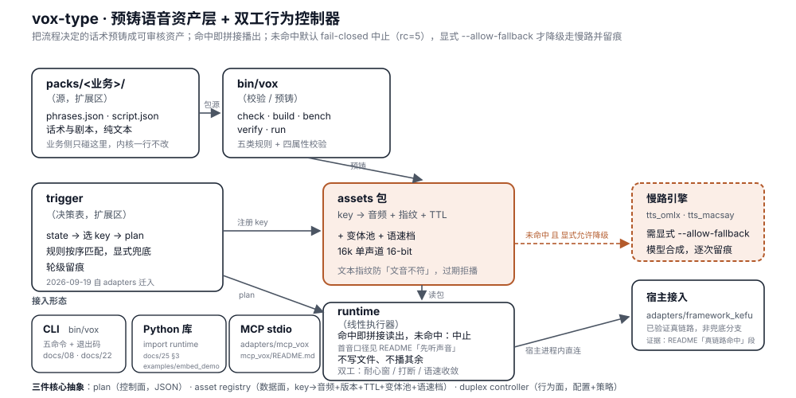

<div align="center">

# vox-type

**Pre-cast voice asset layer + duplex behaviour controller for voice agents**
**语音链路的预铸话术资产层 + 双工行为控制器**

[](LICENSE)
[](https://www.python.org)
[](https://github.com/starmcainiao/vox-type/actions/workflows/tests.yml)
[](#quick-start)

</div>

> 客服电话里流程写死的那几句，提前存成音频；轮到它时直接播，不等 AI 现场生成。
> 什么时候该用：流程固定的话（问候、转人工、报修确认、告别）——提前存好就行。
> 什么时候不该用：用户每次说得都不一样、必须现想的话（投诉解释、个性化答复）——那些还是交给模型。

**你什么时候需要它**：做客服 / 催收 / 政务 IVR，首响被 TTS 合成卡住，**且有一部分话术是流程写死的**
（问候、转人工、报修确认、告别）——那部分话术用它；全是自由对话的系统不需要它。

> **第一次来？→ 先读 [`docs/22-五分钟跑起来`](docs/22-五分钟跑起来.md)**（clone 到听见声音，全真值输出）·
> 一命令自检环境与零引擎 `run` → `sh examples/selftest.sh`（端点在线时会额外做一次全量铸包，
> 可能耗时几分钟、中途没有进度输出）·
> 想看可跑的示例 → [`examples/`](examples/README.md) · 想加一个 TTS 引擎 → [`docs/23`](docs/23-如何新增一个TTS引擎.md)

## Architecture

```
 compiler（编译期管线）        trigger（决策表）           runtime（线性执行器）
 phrases.json ──预铸──▶  assets 包 ◀──选 key──  state → plan ──▶ 播包/槽位合成/事件流
   │  五类规则校验         │ key→音频+指纹+TTL     │ 规则按序匹配       │
   │  四属性校验          │ +变体池+语速档         │ 显式兜底           │ 未命中 → fail-closed（默认 rc=5）
   ▼                     ▼                      ▼                   ▼    显式 --allow-fallback 才降级→宿主TTS（留痕）
 packs/<业务>/（数据）─── bin/vox（check/build/bench/verify/run）─── adapters/<宿主>（钩子）
```

**进阶定位**：可短路语音栈的覆盖层——级联链路（ASR→LLM→TTS）里坐在 LLM 与 TTS 之间，端到端 S2S 模型里做整轮旁路；让语音链路里流程决定的那部分话术零延迟、零成本、可审核，不确定的部分才动用模型。

三件核心抽象（协议草案见 [`docs/02-protocols-draft.md`](docs/02-protocols-draft.md)）：

| 件 | 职责 | 形态 |
|---|---|---|
| **plan** | 控制面：模型/状态机输出 `{key, slots, variant, rate}` 序列，而非自由文本 | JSON 协议 |
| **asset registry** | 数据面：`key → 音频 + 版本 + TTL + 变体池 + 语速档`，文本指纹防「文音不符」 | 端上 SQLite+文件 / 服务端 KV |
| **duplex controller** | 行为面：耐心窗、语速档收敛、留白/背景回应、打断策略 | 配置 + 策略代码 |



（架构图源文件 [`docs/media/architecture.svg`](docs/media/architecture.svg) 是纯文本 SVG，可直接 diff 与审阅；
上方 ASCII 版是它的文字等价物。`未命中 → fail-closed` = 默认中止 `rc=5`，显式 `--allow-fallback` 才降级走宿主原 TTS（留痕）——口径见下「English one-liner」。）

## 先听声音：30 秒，零引擎（不需要 TTS 服务）

> 不想先装 oMLX / 铸包？仓里带了一份**预铸好的自证包**，clone 完直接播——
> 全程磁盘读，**一次合成都没发生**（`tts_calls=0`），端点离线也能跑。

🎧 **[demo.wav](docs/media/demo.wav)** —— 一段真人耳朵能听差的快路播报，由
[`packs/heat_kefu`](packs/heat_kefu/) 的自造话术经 `sh bin/vox run` 生成
（`hit` 命中、`tts_calls=0`：是磁盘读，不是合成）。

> 演示用的是**供热报修场景的示例业务**，不是产品定位——接入时把 `packs/<你的业务>/` 换成你自己的。

```sh
git clone https://github.com/starmcainiao/vox-type && cd vox-type

sh bin/vox run examples/plan.json \
    --pack examples/prebuilt-pack \
    --adapter adapters.tts_omlx:OmlxTts \
    --out /tmp/prebuilt.wav
# → run: 通过（hit=4 miss=0 fallback=0 tts_calls=0 first_audio_ms=<随机器与冷热缓存漂移>）

sh bin/vox verify examples/prebuilt-pack     # 产物可质检 → rc=0
afplay /tmp/prebuilt.wav                     # 听一下（非 macOS 用别的播放器）
```

完整推导（为什么 `--adapter` 仍须显式给、预铸包来源与重铸口径）见
[`examples/README.md`](examples/README.md) 与 [`examples/prebuilt-pack/PROVENANCE.md`](examples/prebuilt-pack/PROVENANCE.md)。

**English one-liner**: vox-type pre-bakes the *process-determined* portion of a voice agent's
dialogue into audited, versioned audio assets, and plays them in 0.475–4.176 ms
(P50 0.715 ms, N=50, measured on one machine) when the upstream model decides to speak them —
on a miss it **fails closed by default and aborts the plan (`rc=5`, no audio, no other units played)**;
only with explicit `--allow-fallback` does it degrade to the slow path (host-side TTS synthesis),
with every degrade traced.
Zero third-party dependencies.

## Quick Start

> 纯标准库，Python ≥ 3.12；零第三方依赖。

> **第一次来？先看 [`docs/22-五分钟跑起来`](docs/22-五分钟跑起来.md)**——那份从 clone 到听见声音，
> 每条命令都贴了**实机跑出来的真值输出**，并如实列出当前还不好用的地方。下面是最短版本。
> 示例 plan 与示例语料已落成真文件：[`examples/plan.json`](examples/plan.json)、
> [`examples/bench-corpus.json`](examples/bench-corpus.json)（逐条命令见 [`examples/README.md`](examples/README.md)）。

```sh
git clone https://github.com/starmcainiao/vox-type && cd vox-type

# 1) 铸一个业务包（源码 packs/heat_kefu/ → 资产包；预铸成功率必须 100%）
#    ⚠️ 前提：模型 TTS 需先设 VOX_TTS_ENDPOINT（可达的 OpenAI 兼容 /v1/audio/speech 端点）并装 ffmpeg（详见下方 ⚠️ 前提）
sh bin/vox pack build packs/heat_kefu --adapter adapters.tts_omlx:OmlxTts --out /tmp/vox-demo/heat-kefu

# 2) 播一句：plan 就是「这一轮要说什么」的 JSON 数组
printf '[{"key": "opening__1"}, {"key": "opening__2"}]' > /tmp/vox-demo/plan.json
sh bin/vox run /tmp/vox-demo/plan.json --pack /tmp/vox-demo/heat-kefu --adapter adapters.tts_omlx:OmlxTts --out /tmp/vox-demo/out.wav
# → hit=2 miss=0 tts_calls=0 first_audio_ms=<随机器与冷热缓存漂移，非固定值>
#    ↑ 「零 TTS 调用」就是本项目的字面价值：这两句是磁盘读，不是合成
#    ↑ first_audio_ms 的**形状恒定、数值不定**：同一台机冷热不同也会差一个量级
#     （已实跑到的真值见 examples/README.md 与 labs/frontpack-value/report.json）；
#      本行不写死数字，因为任何写死的数字都会立刻过期。
#    ↑ 另外：这个数**不含 Python 进程启动**，所以它 ≠ 你敲一条命令看到的墙钟时间
#      ——「引擎就绪后首音」与「从零敲命令」是两个口径，量级差约两个数量级
#      （两组数字口径不同，细节见下方 ⚠️ 口径说明）。
afplay /tmp/vox-demo/out.wav      # 听一下（非 macOS 用别的播放器）

# 3) 查包 / 质检
sh bin/vox pack check packs/heat_kefu --json
sh bin/vox verify /tmp/vox-demo/heat-kefu

# 4) 跑全量测试（十一个测试根；不装任何第三方依赖）
#    单一真源是 tools/run_all_tests.py —— 十一个根的 tests 包名全撞，必须逐根隔离子进程跑，
#    末行打印分项口径（ran / skipped / executed / failed）与失败根点名。上面 Status 一节的
#    测试数就是这条命令的输出抄件；要数字请重跑它，不要抄文档。
python3 tools/run_all_tests.py
# → ran=1649 skipped=0 executed=1649 failed=1 failures=1 errors=0 roots=11
#   （本机实跑抄件，2026-09-28。skipped=0 只在本机成立：换环境会变，要数字请重跑这条命令。）
#   ⚠️ 那条 failed=1 是 `packs` 根的**同源指纹断言**在按设计报警：它盯着仓外可选的
#     kefu-agent 集成源 yaml（见下方 Status 一节）。那个 yaml 一改，这条断言就红 ——
#     那是「预铸资产与源话术不同源了」的门禁在报警，不是测试坏了。公开仓不含该 yaml，
#     克隆者只会看到 skip，不会看到 failed。
```

> **macOS `say` 应急（可选）**：已有 macOS 且暂不接 TTS 端点时，可在 `pack build` 命令上**省略**
> `--adapter` 走 macOS 自带 `say`；这只是应急路径，缺省适配器仍写在冻结区 `cli/`。跨平台或生产接入
> 请优先使用上面的 `adapters.tts_omlx:OmlxTts`（OpenAI 兼容 `/v1/audio/speech`，端点由
> `VOX_TTS_ENDPOINT` 指定；另需 `ffmpeg` 做 16 kHz 归一）。

> ⚠️ **前提**：模型 TTS 主线需要 `VOX_TTS_ENDPOINT` 指向可达的 OpenAI 兼容 `/v1/audio/speech`
> 端点（缺省 `http://127.0.0.1:10099`），另需 `ffmpeg` 把常见 24 kHz 输出归一到本仓 16 kHz 契约；
> 音色可用 `VOX_TTS_VOICE` 指定（缺省 `default`）。端点必须是 http/https，写错会**响亮地**抛
> `ValueError`，不会替你悄悄换地址。`VOX_TTS_MODEL` 可选服务端模型名。缺省适配器仍在冻结区
> `cli/`，所以模型路径要显式给 `--adapter`（见 `docs/13` 未完成清单）。

可选评测组件（不装也能跑全量测试）：本机模型服务 oMLX（回读 CER 与 ASR 实测用，
`eval/readback.py --asr adapters.asr_omlx:OmlxAsr`）；kefu-agent 集成见
`adapters/framework_kefu/`（环境变量 `KEFU_AGENT_ROOT` 指向其仓根）。

## Why

### 一眼对比：前置包命中 vs 模型合成

> 下面两个数口径不同（`first_audio_ms` 不含 Python 进程启动），细节与另一组对拍数字见本节末尾的 ⚠️ 口径说明。

| 臂 | 路径 | 首音（本次实测 P50） |
|---|---|---:|
| **快路** | `vox run` 命中即播（磁盘读，零 TTS 调用） | **0.715 ms**（区间 0.475–4.176 ms，N=50） |
| **慢路** | oMLX `Qwen3-TTS-12Hz-0.6B-Base-bf16` 全链路 | **2336.0 ms**（区间 1052.3–6453.6 ms，N=10） |

**P50/P50 ≈ 3,267×**（附注，非测量值）；保守区间约 **252×–9,026×**。同机同句、同 16 kHz 契约，
快路每句重复 5 次取中位数，慢路逐句 1 次；慢路含服务端合成、ffmpeg 归一、落盘与契约复验；
快路 `first_audio_ms` 取自 `vox run` 的 CLI JSON、**不含 Python 进程启动**（别读成「从零拉起进程到首响」；
从零敲命令到首响是数十毫秒量级，见本节末尾口径警告 ①）。
图见 [`docs/media/value-compare.svg`](docs/media/value-compare.svg)，数字唯一来源是
[`labs/frontpack-value/report.json`](labs/frontpack-value/report.json)，口径与局限见
[`labs/frontpack-value/README.md`](labs/frontpack-value/README.md)。
**链路口径另见 [`docs/09`](docs/09-链路级语音对拍-本地客服智能体.md)**（P50 0.232 ms vs 586.7 ms，`say` 口径）——
**那是另一台机器、另一批语料、另一种 TTS，与本表不可混读、不可相减**。

1. **流程话术在替慢链路陪跑。** 一通「查一下账单」的电话，用户要等 ASR + LLM 首 token + TTS
   才能听到「请提供您的户号」——这句话由业务流程决定，却陪整条链路等了几秒，还烧一次推理。
   我们实测：预铸命中读包首响 **P50 0.232 ms**，链路级实时合成 **586.7 ms**（≈2530×，n 见 `docs/09`）。
2. **生成式话术不可审计。** 客服话术（催收/政务/通知）有合规要求，LLM 每次生成都在赌。
   预铸资产 = **字节级一致、可审核、可版本化**；源话术一改，指纹门禁自动让缓存失效（fail-closed）。
   行业背景：AI 骚扰电话投诉年增 230%（财联社 2025-04），厂商靠「500 套合规话术模板」应对——
   模板没有治理，我们有准入判据（[`docs/14`](docs/14-预铸准入判据.md)）。
3. **缓存手法行业皆知，资产层没有开源件。** 「缓存预合成音频」是 Vapi 官方文档里的优化技巧；
   把它做成**有准入、有质检、有指纹、能差量重铸的层**（含双工参数治理）没有现成开源实现
   （同类项目检索见 [`docs/04-prior-art.md`](docs/04-prior-art.md)、市场验证见 [`docs/16`](docs/16-行业痛点与切入点分析.md)）。

**诚实边界**：适用范围 = 流程决定的话轮（真实客服语料实测占 23%，催收/账户服务场景）；
自由对话部分永远走原路——本项目不试图、也不应该覆盖它。

> **⚠️ 本仓有「两组首音数字」，口径不同，不可混读或相减**：
> ① 上面英文行的 `0.715 ms` 与上表同源，唯一真源是
> [`labs/frontpack-value/report.json`](labs/frontpack-value/report.json)（同机同句同 16 kHz 契约，
> 快路每句重复 5 次取中位数，N=50；`first_audio_ms` 取自 `vox run` 的 CLI JSON，**不含 Python 进程启动**
> ——报告原文：「不含 Python 进程启动那几十毫秒」。所以它量的是**引擎就绪后首音到得多快**，
> **不是从零敲一条命令到首响**：后者还含进程启动与 CLI 解析，是**数十毫秒量级**，差约两个数量级。
> 墙钟没有落盘报告（`labs/frontpack-value/` 只量引擎就绪后的首音），所以本行**不写死任何抄件数字**，
> 请在你自己机器上跑一次上面「先听声音」的命令、用 `/usr/bin/time` 或 shell 的 `time` 量它。
> ② [`docs/09`](docs/09-链路级语音对拍-本地客服智能体.md) 另有一组**链路级对拍**数字
> （预铸命中 P50 0.232 ms，n=20 vs 链路实时合成 586.7 ms，`say` 口径，n=36）——**不同机器、不同语料、
> 不同 TTS**，那组数字本身没错，但不能和上表并列比较。

## Status（全部实测，口径见 [`docs/09`](docs/09-链路级语音对拍-本地客服智能体.md) / [`docs/13`](docs/13-未完成清单.md)）

- **测试：11 个测试根，当前 `ran=1649 failed=1`**（2026-09-28 本机实测；`skipped` 随环境变，不是契约）。
  那 1 条是下述同源指纹断言在按设计报警，**其余全绿**；公开仓不含被监视的 yaml，克隆者看到的是 `failed=0`。
  唯一出处 = 命令，重跑它拿你自己的数：`python3 tools/run_all_tests.py`
  yaml 可达 × PyYAML 四组合口径表与各根 skip 条件见 [`tools/README.md`](tools/README.md)；该表未覆盖、故在此保留：
  本机 oMLX `:10099` 端点离线时对应 `adapters` 冒烟用例会 skip；CI 为 Python 3.12/3.13/3.14 三档矩阵，跑前先构建 heat-kefu 包让真包断言生效。
  skip 不是失败，也不是「没跑」，但**它确实意味着那批断言没被验证**。
  **唯一会报 `failed=1` 的情形**：`packs` 根的同源指纹断言（`test_yaml_fingerprint_unchanged`）盯着
  `adapters/framework_kefu` 所依赖的 kefu-agent 仓内 yaml 的 sha256；那个 yaml 一改，它就红。
  **那是「预铸资产与源话术不同源了」的门禁在按设计报警，不是测试坏了**（纪律 D4）——处置要由维护者
  决定是否接受新的同源基线，执行方与本文均无权自行改那个常量。公开仓不含该 yaml，克隆者只会看到 skip。
  2026-09-23 清掉 **4 条 TTL 遗留用例**（夹具吃墙钟 + `executor._diagnose` 判据源不一致，见 [`docs/13`](docs/13-未完成清单.md) §五#22）后**本仓首次全绿**。`bin/vox` 五命令可用；业务包 3 个 + 前置包 demo 1 个（新增业务 = 新增目录，零内核改动）；
- 离线对拍：预铸命中首响 P50 **0.232 ms**（n=20）vs 同引擎实时合成 **586.7 ms**（n=36）；
  慢路 **515.3 ms**（n=20）；出处 [`docs/09`](docs/09-链路级语音对拍-本地客服智能体.md) 实测表；
- **真链路命中**：通过适配器接入开源客服框架（不改对方仓库），实弹 4 轮——
  命中 2 轮返回音频与包内资产 **sha256 字节级相同**，未命中 2 轮诚实走原路；
- **多分句整段也能走快路**（拆句铸入 + 逐字覆盖序列命中，[`docs/10 §10.7`](docs/10-接入取景与命中口径.md)）：
  14 条多分句预设话术 **14/14** 序列命中、命中臂拼接 **P50 5.032 ms** vs 慢路合成
  **P50 568.956 ms**、零 TTS 调用（n=14；出处 `labs/heat-kefu-seq/report.json` 的
  `summary.executor_wall_ms_p50` 与 `summary.slow_arm_say_ms_p50`）；
- 回读 CER 基准可复现（本地 ASR 回读，真机闭环 CER 0.0）；方言域 ASR 边界已实测
  （Wu-Bench 吴语 100 条，CER mean 0.269，见 `labs/wubench-dialect/`）；
- **双工与失效已落地**：四参数各有可观测行为 + 双工质量三指标可复现（`labs/duplex-quality/`）
  + 资产 TTL 过期拒播；预铸查找热路径索引化：n=10,000 时新索引 P50 **0.209–0.792 µs**
  且不随命中位置变化（first/mid/last 均 0.542），旧线性扫描 P50 **0.708–72.667 µs**
  且随命中位置劣化（first 0.708 → last 72.667）；n=200,000 时旧扫描劣化到
  **739.521–2075.979 µs** 而新索引仍为 **0.208–0.833 µs**。
  **打开统计时两者接近**（n=200,000 时 4.5 vs 4.6 µs）——那部分耗时在统计本身，不在扫描。
  （出处 `labs/pack-index-bench/report.json` 的 `sizes[n=…]` 各臂
  `*_no_stat.p50_us` 与 `hit_arm_with_real_stat.*_p50_us` 字段）
  （以上能力的任务级验收记录见 [`docs/tasks/`](docs/tasks/)）

## 演示素材（可直接看 / 直接听）

| 素材 | 是什么 | 怎么复现 |
|---|---|---|
| 🎧 [demo.wav](docs/media/demo.wav) | 一段真人耳朵能听差的快路播报——**由 [`packs/heat_kefu`](packs/heat_kefu/) 的自造话术经 `sh bin/vox run` 生成**（`hit` 命中、`tts_calls=0`，是磁盘读不是合成） | 复现命令写在上方「先听声音：30 秒」一节；输出即本文件 |
| 🗺️ [architecture.svg](docs/media/architecture.svg) | 架构图（纯文本 SVG，可 diff、可离线打开，无外链图片） | 上方 Architecture 一节的 ASCII 图是它的文字等价物 |

数据口径：`demo.wav` 的文本全部来自 `packs/heat_kefu/` 的自造 demo 文案，
不含任何用户录音或真实会话（分级见 `packs/heat_kefu/admission.md`）。

## Documentation

**按你的目的选一条路**：想先听声音 → [`docs/22`](docs/22-五分钟跑起来.md) · 想接进自己的项目 → [`docs/25`](docs/25-怎么在你的项目里用vox-type.md) · 想加 TTS 引擎 → [`docs/23`](docs/23-如何新增一个TTS引擎.md) · 想加 MCP → [`adapters/mcp_vox/`](adapters/mcp_vox/) · 想知道还差什么 → [`docs/13`](docs/13-未完成清单.md)

| 主题 | 文档 |
|---|---|
| 问题界定 / 协议草案 / 设计结论 / 同类检索 / 证据计划 | [docs/01](docs/01-problem-and-scope.md) · [02](docs/02-protocols-draft.md) · [03](docs/03-design-notes.md) · [04](docs/04-prior-art.md) · [05](docs/05-evidence-plan.md) |
| 预铸与执行口径 / 剧本四属性 / CLI 行为口径 | `docs/06` ~ `docs/08` |
| 真链路对拍 / 命中口径 / 语料自给实测（23% 边界） | `docs/09` ~ `docs/11` |
| **预铸准入判据**（哪些话允许"固定"；新增 key 前必读） | [`docs/14`](docs/14-预铸准入判据.md) |
| 市场验证 / 业界坐标与改造预测 / **里程碑修订** | [16](docs/16-行业痛点与切入点分析.md) · [17](docs/17-业界坐标与改造预测.md) · [19](docs/19-里程碑修订.md) |
| **开源就绪评估**（内部合规自审，非新人必读） | [18](docs/18-开源就绪评估.md) |
| **开源语音栈坐标与前置包适配判断**（能插在哪、接缝在哪；含未核实清单） | [`docs/21`](docs/21-开源语音栈坐标与前置包适配判断-2026-09.md) |
| **合规自审记录**（预铸准入 + 数据许可，拍板人已签字） | [`docs/20`](docs/20-合规自审记录.md) |
| 前置包定位 / 未完成清单（单一事实源） | [docs/12](docs/12-前置包-定位与任务清单.md) · [`docs/13`](docs/13-未完成清单.md) |
| **五分钟跑起来**（唯一一份上手指南，clone → 听见声音） | [`docs/22`](docs/22-五分钟跑起来.md) |
| **接入形态与评判**（零第三方依赖、毫秒首音何时兑现） | [`docs/24`](docs/24-接入形态与评判.md) |
| **如何新增一个 TTS 引擎**（新人 how-to：契约项 / 接口 / 测试） | [`docs/23`](docs/23-如何新增一个TTS引擎.md) |
| **示例 plan、语料与零引擎自证包**（可跑，含演示音频复现命令） | [`examples/`](examples/README.md) · [`examples/prebuilt-pack/`](examples/prebuilt-pack/) |
| **一命令自证**（环境自检、零引擎 `run`、可选完整链路） | [`examples/selftest.sh`](examples/selftest.sh) |
| **MCP 接入适配器**（工具面薄适配器） | [`adapters/mcp_vox/`](adapters/mcp_vox/) |
| **Agent 技能包**（给宿主 agent 看的说明书；装到国产/大厂宿主的对照表见其内 README） | [`adapters/skills/vox-type/`](adapters/skills/vox-type/) |
| 全部任务卡与逐卡验收记录 / 实验区 | `docs/tasks/` · `labs/` |

## Roadmap

- [x] M1 · 八层机制闭环（compiler → assets → runtime → eval，离线对拍出数）
- [x] M2 · 真链路集成（kefu 钩子 21 行接入 + 实弹命中，字节级验证）
- [x] M2.5 · 话术同源包（`packs/heat_kefu`，yaml 指纹门禁）+ 方言域 ASR 边界实测
- [x] **整段 → plan 拼接匹配**：多分句话术的序列命中（T33：`packs/heat_kefu` 拆句铸入 40→69 key +
  `find_hit_sequence` 逐字覆盖；口径 [`docs/10 §10.7`](docs/10-接入取景与命中口径.md)）
- [x] **双工行为控制器**：四参数（耐心窗/背景回应/打断/语速档）从校验走向消费（T19：`policy_stream`
  事件流带等待窗口/背景回应/可打断标记/关键信息强制 slow；T20：双工质量三指标 harness——打断准确率/
  假阳性/轮转延迟，固定种子可复现）
- [x] **资产 TTL / 失效**（T18：`invalid_at` 绝对失效 + `ttl` 预铸折算 + assets 层保险丝，
  过期拒播且 `allow_fallback` 也不放行——「播报过期事实比不播更糟」）
- [ ] **key 约束解码**：用 Trie/FSM 把 LLM 输出空间物理约束到合法 key 集合——
  **已勘察（`labs/guided-decoding/`）：当前运行时不可行**（`json_schema` 400 拒绝、`guided_json` 被静默忽略），
  需换 vLLM + XGrammar / SGLang / Outlines 类运行时
- [x] **回流闭环**：日志挖掘 → 话术建议（T23：`tools/feedback_mining/`，从轮级留痕+事件流挖候选 → 形式条款机器化 + A1/A2 标注待人工 → 建议清单对接 `docs/14` 申报）

## Third-party data & attribution

- `packs/fin-cs/` 话术为**改写**（`docs/11 §11.7` 禁止逐字复制语料原文），源语料 MIT / Apache-2.0，
  来源与 sha256 台账：`labs/corpus-harvest/corpus.lock.json`；
- `labs/corpus-harvest/raw/` 含第三方语料**逐字转写**（均为可再分发许可，来源台账即 attribution）；
- 本仓库不含任何用户录音、会话数据或私有部署信息；真人标注（若未来出现）按 `docs/11 §11.7`
  排除出公开分发；
- 环境变量：`CORPUS_ROOT`（语料根，缺省 `~/corpus`）、`KEFU_AGENT_ROOT`（kefu 仓根）、
  `KEFU_PRECAST_*`（预铸钩子开关）。

## Contributing

设计讨论期：欢迎 issue 质疑协议与边界。提 PR 前请读
[CONTRIBUTING.md](CONTRIBUTING.md)（测试跑法 / 纪律要点：fail-closed、数字必须有出处、
包是数据不是代码）。安全漏洞走 [SECURITY.md](SECURITY.md)，勿用公开 issue。

## License

[Apache-2.0](LICENSE)。与仓内 MIT / Apache-2.0 派生语料兼容；
`packs/*/golden/` 的真人标注资产（若未来出现）不进公开分发。
